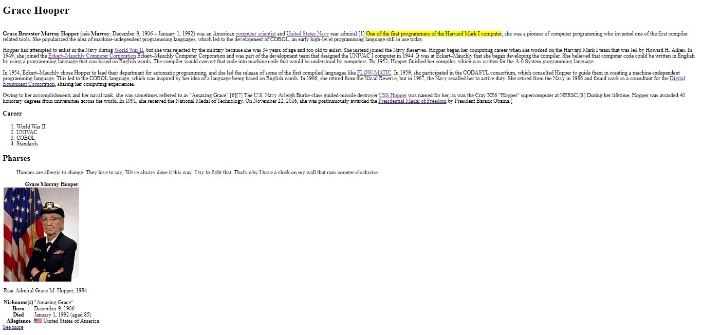

# Replicando la página de Grace Hopper de wikipedia #

## Introducción
El presente trabajo consiste en construir una réplica de la página de Grace Hopper de wikipedia, usando los elementos html más comunes, su comportamiento (inline vs block) y sus atributos principales.

## Vista final
